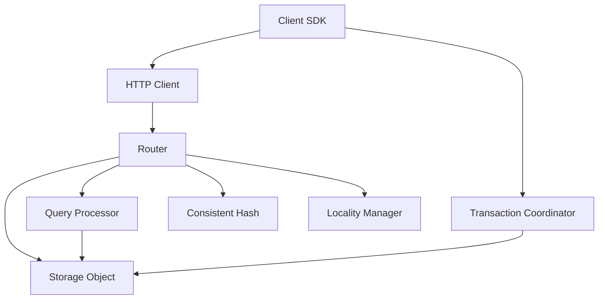

# ImpossibleDB Project Map

This document describes the project structure and architecture of ImpossibleDB, serving as a reference for contributors and maintainers.

## Project Architecture

ImpossibleDB is built on Cloudflare Workers and Durable Objects, with a modular architecture organized around these key components:

1. **Storage Layer**: Durable Objects that store and manage data
2. **Routing Layer**: Intelligent request routing and data sharding
3. **Query Layer**: Query processing and execution across shards
4. **Synchronization Layer**: Transaction management and consistency
5. **Client SDK**: Developer-friendly interface for applications

## File Structure

```
impossibledb/
├── src/                          # Source code
│   ├── index.ts                  # Main entry point and worker setup
│   ├── config.ts                 # Configuration constants
│   ├── types.ts                  # Common TypeScript interfaces
│   ├── objects/                  # Durable Objects implementations
│   │   ├── StorageObject.ts      # Storage shard DO implementation ✅
│   │   ├── ShardManager.ts       # Shard management DO ✅
│   │   ├── TransactionCoordinator.ts # Transaction coordinator DO ✅
│   ├── routing/                  # Routing/Sharding layer
│   │   ├── interfaces.ts         # Interface definitions ✅
│   │   ├── consistentHash.ts     # Consistent hashing implementation ✅
│   │   ├── localityManager.ts    # Locality optimization ✅
│   │   ├── router.ts             # Request routing logic ✅
│   ├── query/                    # Query processing
│   │   ├── parser.ts             # Query language parser ✅
│   │   ├── planner.ts            # Query execution planning ✅
│   │   ├── executor.ts           # Query execution ✅
│   │   ├── aggregator.ts         # Result aggregation ✅
│   ├── sync/                     # Synchronization and consistency
│   │   ├── twoPhaseCommit.ts     # 2PC implementation 🔜
│   │   ├── conflictDetector.ts   # Conflict detection 🔜
│   │   ├── lockManager.ts        # Locking mechanisms 🔜
│   ├── client/                   # Client SDK
│   │   ├── ImpossibleDBClient.ts # Main client interface ✅
│   │   ├── Collection.ts         # Collection operations ✅
│   │   ├── Transaction.ts        # Transaction management ✅
│   │   ├── QueryBuilder.ts       # Query builder pattern ✅
│   │   ├── HttpClient.ts         # HTTP communication layer ✅
│   ├── utils/                    # Utility functions
│   │   ├── logger.ts             # Logging utility ✅
│   │   ├── validation.ts         # Input validation ✅
│   │   ├── errorHandler.ts       # Error handling ✅
├── test/                         # Test files
│   ├── unit/                     # Unit tests
│   │   ├── routing/              # Routing layer tests ✅
│   │   ├── objects/              # Durable Objects tests ✅
│   │   ├── query/                # Query layer tests ✅
│   │   ├── client/               # Client SDK tests ✅
│   │   ├── sync/                 # Synchronization tests 🔜
│   ├── integration/              # Integration tests 🔜
│   ├── e2e/                      # End-to-end tests 🔜
├── docs/                         # Documentation
│   ├── api/                      # API documentation
│   ├── architecture/             # Architecture documentation
│   ├── tutorials/                # Tutorials and guides
├── examples/                     # Example applications
│   ├── simple-crud/              # Basic CRUD example
│   ├── query-demo/               # Query capabilities demo
│   ├── transaction-demo/         # Transaction demo
```

Legend:
- ✅ Implemented and tested
- 🔜 Planned for implementation (see [ROADMAP.md](./ROADMAP.md))

## Module Relationships



## Implementation Status and Priorities

Current implementation status:

1. **Storage Layer**: ✅ Fully implemented with StorageObject, ShardManager, and TransactionCoordinator
2. **Routing Layer**: ✅ Fully implemented with ConsistentHashRing, LocalityAwareRouter, and ShardRouter
3. **Client SDK**: ✅ Fully implemented with transaction support
4. **Query Layer**: ✅ Fully implemented with parser, planner, executor, and aggregator
5. **Synchronization Layer**: ⚠️ Partially implemented (TransactionCoordinator complete, other components needed)

## Design Principles

1. **Modularity**: Each component has a single responsibility
2. **Interface-Driven**: All modules implement well-defined interfaces
3. **Testability**: Code is designed to be easily testable
4. **Performance**: Optimized for low-latency global operations
5. **Developer Experience**: Intuitive APIs and clear documentation

## Contribution Guidelines

When contributing to ImpossibleDB:

1. **Follow the File Structure**: Place new code in the appropriate directory
2. **Implement Interfaces**: Create interfaces before implementation
3. **Write Tests First**: Follow test-driven development practices
4. **Document Your Code**: Add JSDoc comments and update documentation
5. **Follow the Roadmap**: Prioritize features according to [ROADMAP.md](./ROADMAP.md)

For detailed contribution guidelines, see [DEVELOPMENT_WORKFLOW.md](./DEVELOPMENT_WORKFLOW.md).
